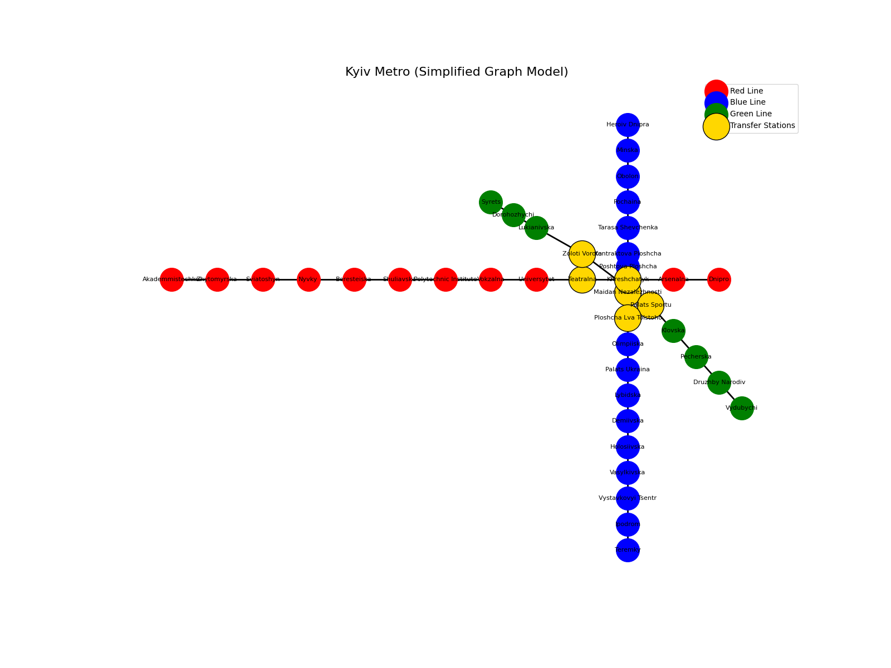

This homework demonstrates working with graphs using the `networkx` library in Python.
A realistic model of a part of the Kyiv underground system was chosen as the graph domain.

The work consists of three dependent tasks:
- graph construction and analysis
- graph traversal using DFS and BFS
- shortest path search using Dijkstra's algorithm

---

## Task 1 — Graph Creation and Analysis

A graph was created to model a part of the Kyiv metro system.

- **Nodes** represent metro stations
- **Edges** represent direct connections between stations
- **Edge weights** represent average travel time between stations (in minutes)
- The graph includes three metro lines (Red, Blue, Green)
- Transfer stations connect different lines and increase graph connectivity

### Graph characteristics analyzed:
- number of nodes (stations)
- number of edges (connections)
- degree of each node

The graph was visualized using a fixed layout with color-coded metro lines
and highlighted transfer stations to improve readability.



---

## Task 2 — DFS and BFS Traversal

Depth-First Search (DFS) and Breadth-First Search (BFS) algorithms were
implemented programmatically without using built-in NetworkX traversal functions.

### Observations:
- **DFS** explores one branch of the graph as deeply as possible before backtracking
- **BFS** explores the graph level by level, visiting all neighboring stations first
- Due to transfer stations and graph structure, traversal order differs significantly

```
DFS path:
['Akademmistechko', 'Zhytomyrska', 'Sviatoshyn', 'Nyvky', 'Beresteiska', 'Shuliavska', 'Polytechnic Institute', 'Vokzalna', 'Universytet', 'Teatralna', 'Khreshchatyk', 'Arsenalna', 'Dnipro', 'Maidan Nezalezhnosti', 'Poshtova Ploshcha', 'Kontraktova Ploshcha', 'Tarasa Shevchenka', 'Pochaina', 'Obolon', 'Minska', 'Heroiv Dnipra', 'Ploshcha Lva Tolstoho', 'Olimpiiska', 'Palats Ukraina', 'Lybidska', 'Demiivska', 'Holosiivska', 'Vasylkivska', 'Vystavkovyi Tsentr', 'Ipodrom', 'Teremky', 'Palats Sportu', 'Zoloti Vorota', 'Lukianivska', 'Dorohozhychi', 'Syrets', 'Klovska', 'Pecherska', 'Druzhby Narodiv', 'Vydubychi']
BFS path:
['Akademmistechko', 'Zhytomyrska', 'Sviatoshyn', 'Nyvky', 'Beresteiska', 'Shuliavska', 'Polytechnic Institute', 'Vokzalna', 'Universytet', 'Teatralna', 'Khreshchatyk', 'Zoloti Vorota', 'Arsenalna', 'Maidan Nezalezhnosti', 'Lukianivska', 'Palats Sportu', 'Dnipro', 'Poshtova Ploshcha', 'Ploshcha Lva Tolstoho', 'Dorohozhychi', 'Klovska', 'Kontraktova Ploshcha', 'Olimpiiska', 'Syrets', 'Pecherska', 'Tarasa Shevchenka', 'Palats Ukraina', 'Druzhby Narodiv', 'Pochaina', 'Lybidska', 'Vydubychi', 'Obolon', 'Demiivska', 'Minska', 'Holosiivska', 'Heroiv Dnipra', 'Vasylkivska', 'Vystavkovyi Tsentr', 'Ipodrom', 'Teremky']
```

The difference in traversal paths is explained by the fundamental strategies
used by DFS and BFS.

---

## Task 3 — Dijkstra's Algorithm

Dijkstra's algorithm was implemented to find the shortest paths
from a given starting station to all other stations in the graph.

### Key points:
- Edge weights were used as travel time
- A priority queue was applied for efficient minimum-distance selection
- Transfer stations influence route choice and total travel time

The algorithm successfully computes realistic shortest paths
within the metro network.

```
Shortest paths from Akademmistechko:
Akademmistechko: 0
Zhytomyrska: 4
Sviatoshyn: 7
Nyvky: 9
Beresteiska: 11
Shuliavska: 13
Polytechnic Institute: 15
Vokzalna: 18
Universytet: 20
Teatralna: 21
Khreshchatyk: 22
Arsenalna: 24
Dnipro: 27
Heroiv Dnipra: 37
Minska: 33
Obolon: 31
Pochaina: 29
Tarasa Shevchenka: 27
Kontraktova Ploshcha: 25
Poshtova Ploshcha: 24
Maidan Nezalezhnosti: 23
Ploshcha Lva Tolstoho: 24
Olimpiiska: 26
Palats Ukraina: 28
Lybidska: 30
Demiivska: 32
Holosiivska: 34
Vasylkivska: 37
Vystavkovyi Tsentr: 40
Ipodrom: 42
Teremky: 44
Syrets: 27
Dorohozhychi: 25
Lukianivska: 23
Zoloti Vorota: 22
Palats Sportu: 23
Klovska: 25
Pecherska: 27
Druzhby Narodiv: 29
Vydubychi: 31
```

---

## Conclusions

This homework demonstrates how classical graph algorithms can be applied
to real-world systems such as urban transport networks.
